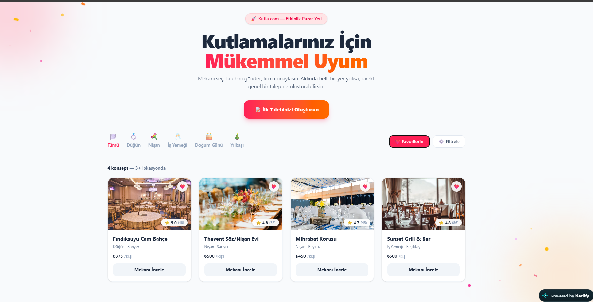
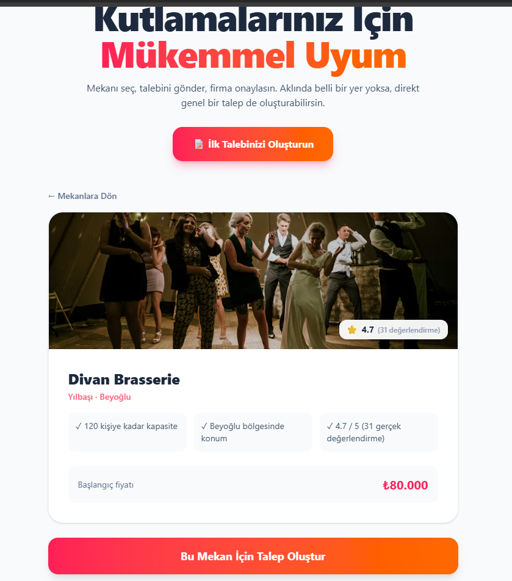
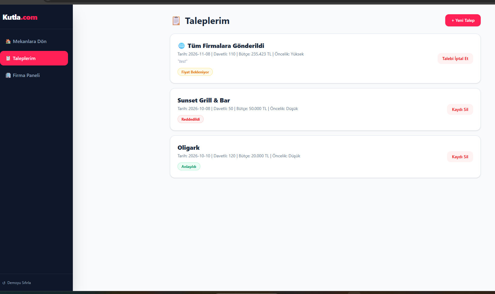
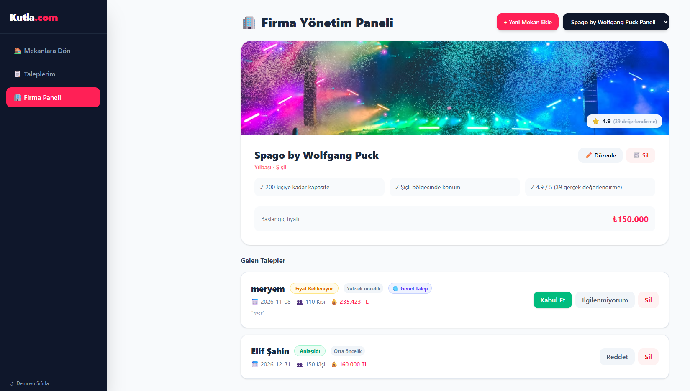
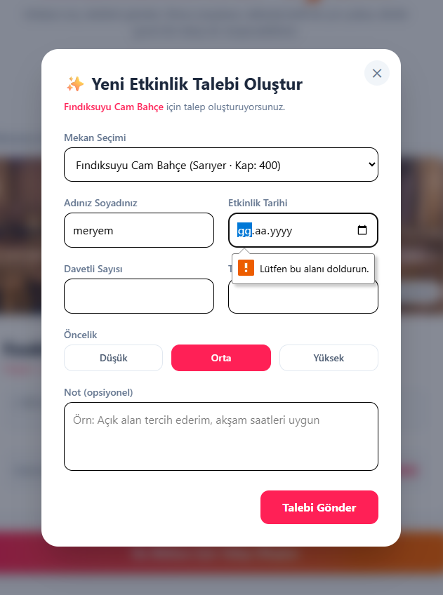
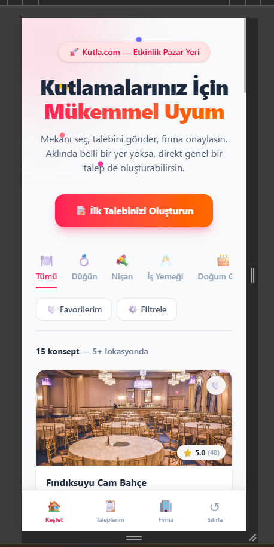

# Kutla.com — Etkinlik Pazar Yeri 🎉

Kutla.com; düğün, nişan, iş yemeği, doğum günü ve yılbaşı gibi organizasyonlar için mekan keşfi ve teklif alma süreçlerini dijitalleştiren modern bir pazar yeri (marketplace) web uygulamasıdır. 

Müşteriler mekanları filtreleyip doğrudan veya genel teklif talepleri oluştururken; mekan sahipleri firma yönetim panelinden rezervasyon ve teklif süreçlerini yönetir, portföy ve doluluk durumunu günceller.

🔗 **Canlı Demo:** [kutlacom.netlify.app](https://kutlacom.netlify.app)  
📂 **GitHub Deposu:** [github.com/MeryemTuzcu/kutla-frontend](https://github.com/MeryemTuzcu/kutla-frontend)

---

## 📸 Ekran Görüntüleri

| Ana ekran | Mekan detayı |
|:-:|:-:|
|  |  |
|  |  |
|  |  |
---

## 🌟 Temel Özellikler

### 👤 Müşteri Deneyimi
* **Kapsamlı Filtreleme:** Mekanları kategori (Düğün, Nişan, İş Yemeği, Doğum Günü, Yılbaşı), ilçe ve bütçeye göre anlık filtreleme.
* **Favori Listesi:** Beğenilen mekanları favorilere ekleme ve tek tıkla yalnızca favorileri listeleme.
* **Çift Yönlü Talep Mimarisi:**
  * *Mekana Özel Talep:* Seçilen mekanın kapasite ve detaylarını inceleyerek doğrudan o mekana teklif iletme.
  * *Genel Talep:* Belirli bir yer seçmeden tüm sisteme açık havuz talebi oluşturma (ilk uygun mekan üstlenir).
* **Taleplerim Ekranı:** Oluşturulan tekliflerin durumunu (*Fiyat Bekleniyor*, *Anlaşıldı*, *Reddedildi*) anlık takip etme ve dilediğinde iptal edebilme.

### 🏢 Firma Yönetim Paneli
* **Mekan Seçimi & Yönetimi:** Portföydeki mekanlar arasında geçiş yaparak profil kartına, kapasiteye ve başlangıç fiyatına erişim.
* **Mekan CRUD Süreçleri:** Yeni mekan kaydı oluşturma, mevcut mekan bilgilerini ve görselini düzenleme, mekanı portföyden silme.
* **Talep Yönetimi:** Gelen teklifleri inceleme, onaylama (*Anlaşıldı*) veya reddetme.
* **Genel Talep Havuzu:** Sisteme düşen genel talepleri inceleyip tek tıkla üstlenme veya ilgilenilmeyen talepleri gizleme.

---

## 📱 Arayüz ve Kullanıcı Deneyimi (UI/UX)

* **Mobile-First & Sabit Alt Bar (Bottom Bar):** Mobilde masaüstü sidebar'ı ve üst butonlar gizlenerek ekranın altına sabit 3 sekmeli (Keşfet, Taleplerim, Firma) native uygulama deneyimi sunan alt menü konumlandırılmıştır.
* **Dinamik Sosyal Kanıt:** Mekan kartlarında güven algısını pekiştiren puan ve toplam değerlendirme sayısı rozeti (`⭐ 4.9 (64)`).
* **Görsel Koruma Kalkanı (Fallback):** Yüklenemeyen veya geçersiz görsel bağlantılarına karşı otomatik yedek görsel devreye girer (`onError`).
* **Özel Diyalog Pencereleri:** Tarayıcının standart bildirim kutuları yerine modern `Modal` ve `ConfirmModal` onay pencereleri kullanılır.

---

## 🛡️ İş Kuralları ve Doğrulamalar (Business Logic)

Sistem veri tutarlılığını sağlamak amacıyla şu kontrolleri uygular:

1. **Minimum Bütçe Denetimi:** 1.000 TL altındaki bütçe girişleri sistem tarafından engellenir (`isBudgetTooLow`).
2. **Kapasite Sınırı:** Davetli sayısı, seçilen mekanın azami kapasitesini aşamaz (`isCapacityExceeded`).
3. **Mükerrer Talep Kalkanı:** Yanıt bekleyen aktif bir talebi bulunan müşteri, aynı mekan için mükerrer bir talep daha oluşturamaz (`isDuplicatePending`).
4. **Çifte Rezervasyon Kilidi:** Bir mekan aynı etkinlik tarihi için yalnızca tek bir anlaşma onaylayabilir. Aynı tarihteki ikinci bir talebi kabul etme girişimi engellenir (`isDoubleBooked`).
5. **Genel Talep Sahiplenme:** Genel talebi kabul eden ilk mekan, talebi doğrudan kendi üzerine bağlar; talep diğer firmaların ekranından kaldırılır.

---

## 🔄 CRUD İşlemleri Matrisi

| İşlem | Müşteri Tarafı | Firma Tarafı |
| :--- | :--- | :--- |
| **Create (Ekle)** | Yeni etkinlik talebi oluşturma (Modal form) | Yeni mekan ekleme (Fotoğraf URL / Hazır şablonlar) |
| **Read (Listele)** | Mekan kataloğu, dinamik filtreler, Taleplerim listesi | Gelen talepler, mekan detayları ve kapasite verileri |
| **Update (Güncelle)** | — *(Müşteri kendi teklifini doğrudan onaylayamaz)* | Talep durumunu güncelleme (Kabul/Red), mekan bilgilerini düzenleme |
| **Delete (Sil)** | Bekleyen talebi iptal etme | Talebi listeden silme, mekanı kalıcı olarak portföyden kaldırma |

---

## 🛠️ Teknolojiler

* **React 19.2.8** (Vite derleyicisi ile)
* **Tailwind CSS** (Responsive & Mobile-first arayüz)
* **LocalStorage** (İstemci tarafı veri kalıcılığı)
* **Netlify** (Sürekli dağıtım / CI-CD)

---

## 📁 Proje Dizin Yapısı

```text
├── docs/
│   └── screenshots/             # Arayüz ve panel ekran görüntüleri
└── src/
    ├── App.jsx                  # Ana yönlendirme, global state ve mobil navigasyon barı
    ├── Components/
    │   ├── ConfirmModal.jsx     # Silme/iptal işlemleri için onay penceresi
    │   ├── Modal.jsx            # Yeniden kullanılabilir pop-up penceresi
    │   ├── RatingBadge.jsx      # Puanlama ve değerlendirme rozeti bileşeni
    │   ├── TaskList.jsx         # Taleplerim ekranı (filtreleme ve iptal mekanizması)
    │   └── VendorImage.jsx      # Mekan görseli ve placeholder/resim bileşeni
    ├── Pages/
    │   ├── CreateTask.jsx       # Doğrulama kurallı talep formu
    │   ├── LandingPage.jsx      # Karşılama ekranı, arka plan efektleri ve vitrin
    │   ├── VendorDashboard.jsx  # Firma yönetim paneli (Mekan & talep yönetimi)
    │   ├── VendorDetail.jsx     # Mekan inceleme ve detay sayfası
    │   ├── VendorList.jsx       # Kategori sekmeleri, filtreler ve mekan kartları
    │   └── VendorProfileCard.jsx# Ortak mekan profil kartı bileşeni
    └── utils/
        ├── categories.js        # Etkinlik kategorileri ve ikon konfigürasyonu
        ├── rules.js             # Bütçe, kapasite ve çifte rezervasyon kuralları
        └── storage.js           # LocalStorage ve veri kalıcılığı yönetimi
```

---

## ⚙️ Kurulum ve Çalıştırma

Projeyi yerel ortamınızda çalıştırmak için:

```bash
# Depoyu klonlayın
git clone https://github.com/MeryemTuzcu/kutla-frontend.git

# Proje klasörüne geçin
cd kutla-frontend

# Bağımlılıkları yükleyin
npm install

# Geliştirme sunucusunu başlatın
npm run dev
```

Tarayıcınızda `http://localhost:5173` adresine giderek uygulamayı test edebilirsiniz. Canlı derleme için `npm run build` komutu `dist` klasörünü üretir.

---

## 🧪 Değerlendirme ve Test Senaryoları

1. **Bütçe Kuralı Testi:** Ana sayfada **İlk Talebinizi Oluşturun** butonuna tıklayın, bütçe alanına 500 TL girin. Sistemin 1.000 TL altı girişleri engellediğini gözlemleyin.
2. **Kapasite Kuralı Testi:** *Thevent Söz/Nişan Evi* (Kapasite: 100) için 200 kişilik bir talep oluşturmayı deneyin; kapasite aşım uyarısını test edin.
3. **Çifte Rezervasyon Kilidi:** **Firma Girişi** → *Fındıksuyu Cam Bahçe Paneli* adımlarını izleyin. 15 Kasım tarihli bekleyen talebi **Kabul Et** butonuna basın; aynı tarihte onaylanmış başka bir anlaşma olduğu için sistemin işlemi durdurduğunu doğrulayın.
4. **Genel Talep Akışı:** Firma panelindeyken 🌐 simgeli genel talebi **Kabul Et** ile üstlenin; talebin o firmaya atandığını ve diğer firmalardan kaldırıldığını inceleyin.
5. **Mekan Ekleme & Düzenleme:** Firma panelinden **+ Yeni Mekan Ekle** butonuna basarak yeni bir mekan tanımlayın veya mevcut mekanın bilgilerini güncelleyin.
6. **Fabrika Ayarlarına Dönüş:** "sıfırlama" butonuna masaüstünde sol menüde, mobilde sayfa altında, ana sayfada alt bilgide, basarak verileri tek tıkla ilk temiz haline döndürün.

---

## 💾 Veri Yönetimi

Uygulama, backend bağımlılığı olmadan test edilebilmesi amacıyla verileri tarayıcının **localStorage** katmanında depolar. Yapılan tüm mekan ve talep güncellemeleri istemci tarafında korunur; arayüz üzerindeki merkezi sıfırlama mekanizmasıyla istenildiği anda ilk kurulum durumuna döndürülebilir.
> **Not:** "Firma Girişi" bir simülasyondur; gerçek kimlik doğrulama yoktur, herhangi bir mekan seçilerek o firma olarak işlem yapılır. Mekan adları, puanlar, değerlendirme sayıları ve görseller örnek amaçlıdır.